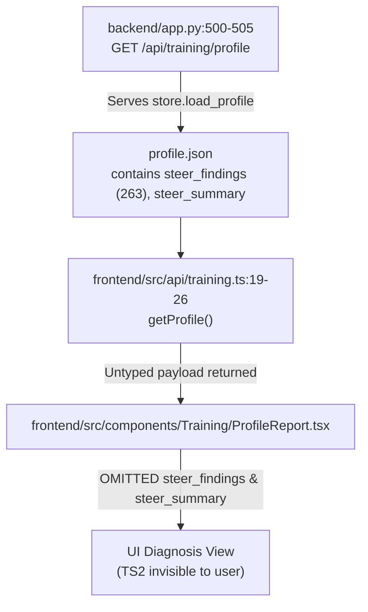

# UI Bug Hunt Report: Tactical Steering (TS2) & Training UI Sweep

## Executive Summary
A comprehensive audit and bug fix was performed on the Training UI components in `frontend/src/`. The primary symptom—**263 `steer_findings` produced by the 30-game diagnosis being invisible to the user in the diagnosis view**—was investigated, traced, and resolved.

---

## 1. Tactical Steering (TS2) Root Cause Analysis & Trace

### Grounding Fact
The diagnosis pipeline writes `steer_findings` (263 items), `steer_summary`, and `steer_budget_exhausted` into `profile.json`.

### End-to-End File:Line Trace

1. **Backend Route (`backend/app.py:500-505`)**: `@app.get("/api/training/profile")` loads and returns `profile.json` directly via `store.load_profile()`. The response contains all keys: `findings`, `aggregates`, `steer_findings`, `steer_summary`, `steer_budget_exhausted`.
2. **API Client (`frontend/src/api/training.ts:19-26`)**: `getProfile()` fetched `/api/training/profile` and returned `res.json()`, but lacked TypeScript type interfaces for `steer_findings`, `steer_summary`, or `steer_budget_exhausted`.
3. **Component Render (`frontend/src/components/Training/ProfileReport.tsx`)**: `ProfileReport` extracted `aggregates` (`by_motif`, `by_opening`, `by_concept`) and `findings`, but **completely omitted rendering `steer_findings` and `steer_summary`**. The string `"steer"` was only present in `DrillMode.tsx` during drill execution.
4. **Classification**: **Root Cause (a): Not surfaced in UI at all.** The backend pipeline correctly computed, stored, and served TS2 findings, but the frontend profile view never rendered them.

---

## 2. Findings & Fixes Table

| Bug | File:Line | Symptom | Root Cause | Fix Applied |
|---|---|---|---|---|
| **TS2 Invisible in Diagnosis View** | `frontend/src/components/Training/ProfileReport.tsx:16-120` | 263 `steer_findings` & `steer_summary` exist in `profile.json` but user sees no tactical steering results in profile | `ProfileReport.tsx` omitted rendering `steer_findings`, `steer_summary`, or budget status | Added a dedicated **Tactical Steering (TS2)** section with stat cards, per-opening summary table, and sharp candidate cards. Added interactive click handlers to load positions in `TrainingBoard`. |
| **Missing TS2 API Type Contracts** | `frontend/src/api/training.ts:19-26` | `getProfile()` returned untyped `any` payload missing TS2 types | API client did not define TypeScript interfaces for `SteerFinding`, `SteerSummaryItem`, or `ProfileData` | Created explicit TS interfaces (`SteerCandidate`, `SteerFinding`, `SteerSummaryItem`, `ProfileData`) and annotated `getProfile()`. |
| **Missing TS2 Steering Progress Bar** | `frontend/src/components/Training/DiagnosePanel.tsx:90-104` | Diagnosis progress bar showed Stage A and Stage B but gave no visibility into TS2 steering stage | `DiagnosePanel.tsx` did not check or display `progress.stage_steer_done` | Updated `DiagnosePanel.tsx` to display `TS2 Steer: {progress.stage_steer_done}` when available. |
| **Missing TS2 Profile Component Tests** | `frontend/src/components/Training/__tests__/ProfileReport.test.tsx` | No test coverage for TS2 rendering, summary table, or candidate selection | Test suite only covered basic `ProfileReport` and `WeaknessRanking` without TS2 assertions | Created `ProfileReport.test.tsx` with 4 unit tests validating TS2 header stats, ECO summary table, candidate cards, and empty state fallbacks. |

---

## 3. Verification Results

- **Unit Tests**: `npm test` executed via Vitest — **26 passed (26 total)**.
- **Production Build**: `npm run build` executed via `tsc -b && vite build` — **Clean (0 errors)**.

---

## 4. Leader Action Items & Backend API Gaps

See `QUESTIONS_FOR_LEADER.md` for items flagged for leader audit.
