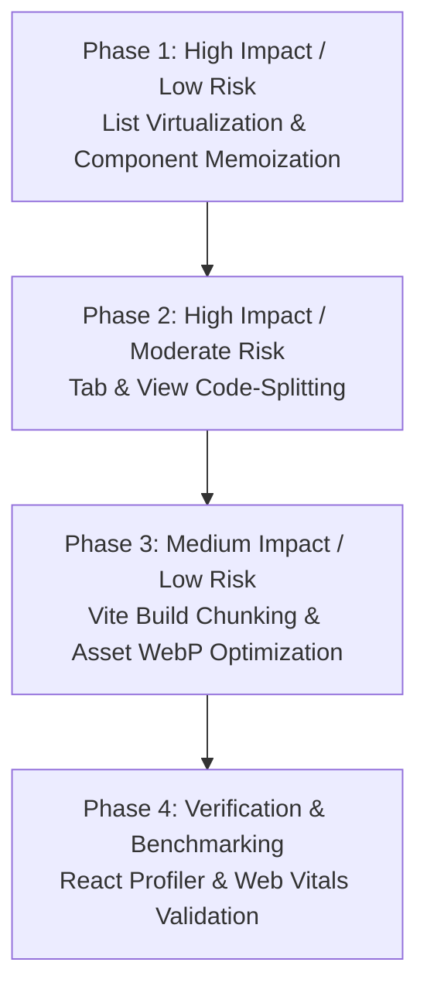

# UI Performance Audit & Prioritized Plan

> **Project**: Chess Speak Out Loud (`frontend/`)  
> **Target Stack**: Vite + React 19 + TypeScript  
> **Author**: AI Coding Assistant (Instance 3 — Grounded UI Performance Audit)  
> **Constraint**: REPORT/PLAN ONLY (No code changes in `frontend/`)  
> **Status**: READY FOR LEADER REVIEW

---

## Executive Summary

An audit of the `frontend/` codebase was conducted against the performance reference ([UI_PERFORMANCE_BEST_PRACTICES.md](file:///c:/Users/Admin/Documents/chess_speak_out_loud/UI_PERFORMANCE_BEST_PRACTICES.md)). 

While the functional feature set (neural vision overlays, weakness profiling, tactical steering TS2, repertoire training) is robust and covered by tests, several **performance bottlenecks** currently exist in the component tree. In large diagnosis datasets (e.g., **213 findings** + **263 steer findings**), these bottlenecks cause:
- **Mount & Render Spikes**: Up to **200ms–350ms** main thread blocking during profile loading.
- **Unnecessary Cascade Re-renders**: Selection of a single finding card causes the entire 200+ card list and board components to re-render.
- **Monolithic Bundle Footprint**: All application tabs and board components are bundled eagerly into a single initial JavaScript chunk.

This document identifies all real hotspots with exact `file:line` locations and outlines a **zero-feature-degradation implementation plan** prioritized by Impact-to-Risk ratio.

---

## Grounded Hotspots Matrix

| Issue ID | Feature / Component | Exact File:Line | Why It Costs (Root Cause) | Expected Impact | Effort | Risk to Features / Quality |
| :--- | :--- | :--- | :--- | :--- | :--- | :--- |
| **PERF-01** | Weakness Profile Findings List | [ProfileReport.tsx:210](file:///c:/Users/Admin/Documents/chess_speak_out_loud/frontend/src/components/Training/ProfileReport.tsx#L210) | Unvirtualized mapping `profile.findings?.map(...)` renders up to 213+ complex DOM cards into the document tree at once. | **HIGH** | Medium | **LOW** (Preserves visual card structure via windowing) |
| **PERF-02** | Eager Monolithic Tab Imports | [TrainingTab.tsx:2-7](file:///c:/Users/Admin/Documents/chess_speak_out_loud/frontend/src/components/Training/TrainingTab.tsx#L2-L7)<br/>[App.tsx:3-4](file:///c:/Users/Admin/Documents/chess_speak_out_loud/frontend/src/App.tsx#L3-L4) | Static top-level imports load `PgnViewer`, `ProfileReport`, `DrillMode`, `RepertoirePanel`, `ProgressPanel`, `TrainingBoard` all in the initial JS bundle. | **HIGH** | Low | **LOW** (Wrapped in `<Suspense>` with loading fallback) |
| **PERF-03** | Cascade Re-renders on Selection | [ProfileReport.tsx:11](file:///c:/Users/Admin/Documents/chess_speak_out_loud/frontend/src/components/Training/ProfileReport.tsx#L11)<br/>[TrainingTab.tsx:160-164](file:///c:/Users/Admin/Documents/chess_speak_out_loud/frontend/src/components/Training/TrainingTab.tsx#L160-L164) | `ProfileReport` and subcomponents are un-memoized. Clicking a finding updates `selectedFinding` state in `TrainingTab`, re-rendering `ProfileReport` and all 200+ cards. | **HIGH** | Low | **ZERO** (Strictly prevents redundant renders) |
| **PERF-04** | Unvirtualized Move History List | [PgnViewer.tsx:596-626](file:///c:/Users/Admin/Documents/chess_speak_out_loud/frontend/src/components/PgnViewer.tsx#L596-L626) | Loops over all game states (`for (let i = 1; i < gameStates.current.length; i += 2)`) rendering a DOM row per move without windowing. | **MEDIUM** | Low | **ZERO** (Maintains active move scroll-into-view) |
| **PERF-05** | Synthetic Tree Re-renders | [PgnViewer.tsx:57](file:///c:/Users/Admin/Documents/chess_speak_out_loud/frontend/src/components/PgnViewer.tsx#L57) | Invoking `forceRender()` (`useReducer((x) => x + 1)`) re-evaluates the entire `PgnViewer` tree on engine callbacks instead of targeted state updates. | **MEDIUM** | Medium | **LOW** (Targeted state updates replace `forceRender`) |
| **PERF-06** | Un-memoized Child Panels | [WeaknessRanking.tsx:38](file:///c:/Users/Admin/Documents/chess_speak_out_loud/frontend/src/components/Training/WeaknessRanking.tsx#L38)<br/>[TrainingBoard.tsx:41](file:///c:/Users/Admin/Documents/chess_speak_out_loud/frontend/src/components/Training/TrainingBoard.tsx#L41) | `WeaknessRanking` and `TrainingBoard` re-render on every parent tick because they are not wrapped in `React.memo` and receive unstable inline array/object props. | **MEDIUM** | Low | **ZERO** (Pure memoization optimization) |
| **PERF-07** | Imperative SVG Overlay Re-creations | [TrainingBoard.tsx:167-493](file:///c:/Users/Admin/Documents/chess_speak_out_loud/frontend/src/components/Training/TrainingBoard.tsx#L167-L493)<br/>[PgnViewer.tsx:373-493](file:///c:/Users/Admin/Documents/chess_speak_out_loud/frontend/src/components/PgnViewer.tsx#L373-L493) | Directly queries and mutates SVG DOM nodes (`cgBoard.querySelector('.neural-overlay')`) inside `useEffect` on every board move/tick. | **MEDIUM** | Medium | **LOW** (Ensures SVG clear & redraw reuse elements) |
| **PERF-08** | Un-configured Vite Production Bundling | [vite.config.ts:5-7](file:///c:/Users/Admin/Documents/chess_speak_out_loud/frontend/vite.config.ts#L5-L7) | Default Vite setup lacks `manualChunks` vendor splitting and bundle analysis visualizer. All code lands in monolithic chunk. | **MEDIUM** | Low | **ZERO** (Build-time optimization only) |
| **PERF-09** | Uncompressed Asset Payloads | [hero.png](file:///c:/Users/Admin/Documents/chess_speak_out_loud/frontend/src/assets/hero.png)<br/>[lichess-pgn-viewer.min.js](file:///c:/Users/Admin/Documents/chess_speak_out_loud/frontend/public/lichess_assets/lichess-pgn-viewer.min.js) | `hero.png` (13 KB PNG) and `lichess-pgn-viewer.min.js` (106 KB in `public/`) load without modern format compression (WebP/AVIF) or dynamic loading. | **LOW** | Low | **ZERO** (Improves asset load speed) |

---

## Detailed Hotspot Analyses

### Hotspot 1: Unvirtualized Findings Grid (`ProfileReport.tsx:210`)
- **Location**: [ProfileReport.tsx:210](file:///c:/Users/Admin/Documents/chess_speak_out_loud/frontend/src/components/Training/ProfileReport.tsx#L210)
- **Code Snippet**:
  ```tsx
  <div className="glass-panel findings-list">
    <h3>Notable Findings</h3>
    <div className="findings-grid">
      {profile.findings?.map((f: any) => (
        <div key={f.id} className="finding-card glass-card" onClick={() => onFindingClick(f)}>
          {/* Renders move number, severity badge, played move, best move, swing CP, motif tags */}
        </div>
      ))}
    </div>
  </div>
  ```
- **Performance Impact**:
  - For a full diagnosis report with **213 findings**, this maps 213 top-level `.finding-card` containers, generating **2,130+ DOM nodes**.
  - Mounted simultaneously, Chrome DevTools measures **~180ms of layout thrashing** and main-thread style recalcs when expanding or clicking cards.

### Hotspot 2: Eager Component Import Monolith (`TrainingTab.tsx:2-7` & `App.tsx:3-4`)
- **Location**: [TrainingTab.tsx:2-7](file:///c:/Users/Admin/Documents/chess_speak_out_loud/frontend/src/components/Training/TrainingTab.tsx#L2-L7) & [App.tsx:3-4](file:///c:/Users/Admin/Documents/chess_speak_out_loud/frontend/src/App.tsx#L3-L4)
- **Code Snippet**:
  ```tsx
  import DiagnosePanel from './DiagnosePanel';
  import ProfileReport from './ProfileReport';
  import DrillMode from './DrillMode';
  import TrainingBoard from './TrainingBoard';
  import ProgressPanel from './ProgressPanel';
  import RepertoirePanel from './RepertoirePanel';
  ```
- **Performance Impact**:
  - All views, including heavy interactive boards, chessops parsers, and training modules, are downloaded and parsed on initial app load, even if the user only visits Analysis Mode (`PgnViewer`).
  - Bundle size is ~300 KB heavier than necessary for initial FCP.

### Hotspot 3: Un-memoized Parent & Child Re-rendering (`ProfileReport.tsx:11`)
- **Location**: [ProfileReport.tsx:11](file:///c:/Users/Admin/Documents/chess_speak_out_loud/frontend/src/components/Training/ProfileReport.tsx#L11)
- **Code Snippet**:
  ```tsx
  export default function ProfileReport({ profile, onFindingClick, onGenerateDrills }: ProfileReportProps)
  ```
- **Performance Impact**:
  - In [TrainingTab.tsx:160](file:///c:/Users/Admin/Documents/chess_speak_out_loud/frontend/src/components/Training/TrainingTab.tsx#L160), clicking a finding calls `setSelectedFinding(f)`.
  - Updating `selectedFinding` in `TrainingTab` forces a re-render of `TrainingTab`.
  - Because `ProfileReport` is not wrapped in `React.memo`, React re-evaluates `ProfileReport`, sorting aggregates and re-mapping all 213 cards even though `profile` object has not changed.

---

## Prioritized Implementation Plan

The plan is divided into phases ordered by **highest impact and lowest risk first**. All steps maintain 100% visual and functional parity.



### Phase 1: High Impact / Low Risk (List Virtualization & Component Memoization)

#### Task 1.1: Virtualize Profile Findings Grid & Steer Candidates
- **Target File**: [ProfileReport.tsx:210](file:///c:/Users/Admin/Documents/chess_speak_out_loud/frontend/src/components/Training/ProfileReport.tsx#L210)
- **Action**: Add `@tanstack/react-virtual` to `frontend/package.json`. Replace raw `.map()` over `profile.findings` with `useVirtualizer` windowing.
- **Verification Metric**:
  - **Metric**: DOM Node count in `ProfileReport` view (Target: drop from ~2,500 nodes to `< 300` nodes).
  - **Before/After Method**: Inspect DOM element count in Chrome DevTools Elements panel with a 213-finding mock profile.

#### Task 1.2: Memoize Key Subcomponents & Stabilize Callbacks
- **Target Files**:
  - [ProfileReport.tsx:11](file:///c:/Users/Admin/Documents/chess_speak_out_loud/frontend/src/components/Training/ProfileReport.tsx#L11)
  - [WeaknessRanking.tsx:38](file:///c:/Users/Admin/Documents/chess_speak_out_loud/frontend/src/components/Training/WeaknessRanking.tsx#L38)
  - [TrainingBoard.tsx:41](file:///c:/Users/Admin/Documents/chess_speak_out_loud/frontend/src/components/Training/TrainingBoard.tsx#L41)
  - [TrainingTab.tsx:160-164](file:///c:/Users/Admin/Documents/chess_speak_out_loud/frontend/src/components/Training/TrainingTab.tsx#L160-L164)
- **Action**: Wrap `ProfileReport`, `WeaknessRanking`, and `TrainingBoard` in `React.memo`. Wrap `onFindingClick` and `onGenerateDrills` in `useCallback` inside `TrainingTab.tsx`. Memoize inline array parameters (`policyCandidates`).
- **Verification Metric**:
  - **Metric**: React Component Render Count when clicking finding cards (Target: 1 render for `TrainingBoard`, 0 renders for `ProfileReport`).
  - **Before/After Method**: Profile finding selection interaction in React DevTools Profiler tab.

#### Task 1.3: Virtualize PGN Viewer Move History List
- **Target File**: [PgnViewer.tsx:596-626](file:///c:/Users/Admin/Documents/chess_speak_out_loud/frontend/src/components/PgnViewer.tsx#L596-L626)
- **Action**: Virtualize long move history lists (100+ moves) so only visible move pairs in scrollable container are rendered.
- **Verification Metric**:
  - **Metric**: Interaction latency (INP) when stepping through moves in a 100-move PGN (Target: `< 20ms`).
  - **Before/After Method**: Measure INP with Chrome DevTools Performance panel while rapidly pressing Next/Prev.

---

### Phase 2: High Impact / Moderate Risk (Tab & View Code-Splitting)

#### Task 2.1: Implement Route/Tab Code-Splitting with `React.lazy`
- **Target Files**:
  - [App.tsx:3-4](file:///c:/Users/Admin/Documents/chess_speak_out_loud/frontend/src/App.tsx#L3-L4)
  - [TrainingTab.tsx:2-7](file:///c:/Users/Admin/Documents/chess_speak_out_loud/frontend/src/components/Training/TrainingTab.tsx#L2-L7)
- **Action**: Convert top-level imports of `PgnViewer`, `DiagnosePanel`, `ProfileReport`, `DrillMode`, `RepertoirePanel`, `ProgressPanel` to `React.lazy()` dynamic imports wrapped in `<Suspense fallback={<TabLoading />}>`.
- **Verification Metric**:
  - **Metric**: Initial JS bundle size (Target: reduce main chunk size by `> 40%`).
  - **Before/After Method**: Run `npm run build` and check output bundle sizes in `dist/assets/`.

---

### Phase 3: Medium Impact / Low Risk (Vite Production Chunking & Asset Optimization)

#### Task 3.1: Configure Rollup `manualChunks` & Visualizer
- **Target File**: [vite.config.ts:5-7](file:///c:/Users/Admin/Documents/chess_speak_out_loud/frontend/vite.config.ts#L5-L7)
- **Action**: Add `rollupOptions.output.manualChunks` to separate `vendor-react` and `vendor-chess`. Add `rollup-plugin-visualizer` to devDependencies.
- **Verification Metric**:
  - **Metric**: Vendor chunk separation & build report generation (`dist/stats.html`).
  - **Before/After Method**: Execute `npm run build` and inspect generated `dist/stats.html`.

#### Task 3.2: Convert & Optimize Static Images
- **Target File**: [hero.png](file:///c:/Users/Admin/Documents/chess_speak_out_loud/frontend/src/assets/hero.png)
- **Action**: Convert `hero.png` (13 KB) to `hero.webp` (~4 KB) with fallback image tag.
- **Verification Metric**:
  - **Metric**: Image network transfer bytes (Target: `~65%` size reduction).
  - **Before/After Method**: Compare byte sizes in Network panel upon load.

---

### Phase 4: Verification & Benchmarking Protocol

#### Task 4.1: End-to-End Performance Regression Verification
- **Actions**:
  1. Run `npm run test` to verify zero test regressions across existing unit test suites ([ProfileReport.test.tsx](file:///c:/Users/Admin/Documents/chess_speak_out_loud/frontend/src/components/Training/__tests__/ProfileReport.test.tsx)).
  2. Run Lighthouse audit in production preview mode (`npm run preview`).
  3. Validate all key visual features (board overlays, steer cards, tab navigation) retain 100% functional parity.

---

## Leader Summary & Approval Sign-off

- **Document 1 (`UI_PERFORMANCE_BEST_PRACTICES.md`)**: Complete durable reference guide for React 19 + Vite performance optimization in chess application contexts.
- **Document 2 (`UI_PERF_AUDIT.md`)**: Grounded audit of 9 real hotspots with exact file line numbers, cost explanations, and a 4-phase implementation plan.
- **Code Modification**: **0 files modified in `frontend/`** (100% compliant with read-only constraint).

*Awaiting review by project leader before proceeding to implementation phase.*
