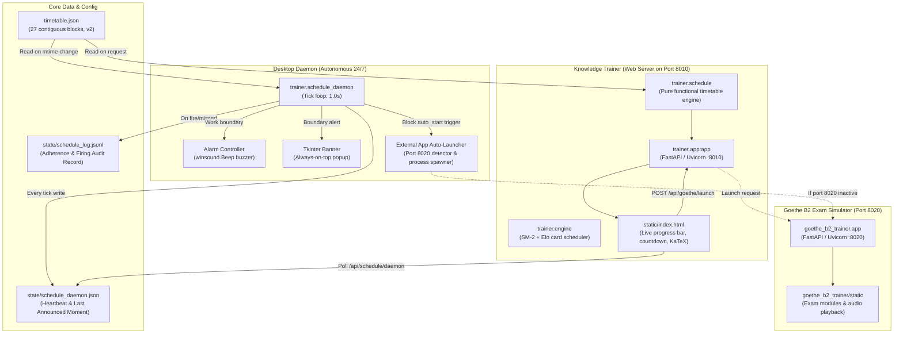

# TIMETABLE & KNOWLEDGE TRAINER SYSTEM BLUEPRINT
**The Complete Technical Architecture, Runtime Specifications, Dependency Mappings, Operating Doctrines, and Verification Protocols**

*Author: Antigravity Agent*  
*Target System: Windows Dev Environment (`C:\Users\Admin`)*  
*Effective Date: 22 September 2026 (v2.0 Architecture)*  
*Primary Repositories:*  
- Codebase & Runtime: [`C:\Users\Admin\Documents\chess_speak_out_loud\trainer`](file:///c:/Users/Admin/Documents/chess_speak_out_loud/trainer)  
- Exam Simulator: [`C:\Users\Admin\Documents\chess_speak_out_loud\goethe_b2_trainer`](file:///c:/Users/Admin/Documents/chess_speak_out_loud/goethe_b2_trainer)  
- Operational Strategy: [`C:\Users\Admin\Documents\bioinformatics_project\job_search`](file:///c:/Users/Admin/Documents/bioinformatics_project/job_search)  

---

## 1. Executive Summary & Core Mission

The **Timetable System** is a 24/7 mission-critical operational harness designed to enforce an unbroken, high-velocity daily routine (03:00 wake-up to 20:00 wind-down / sleep). It governs:
1. **The Application Engine**: Guaranteeing 4+ hours/day of focused job scouting, bespoke letter drafting, and LaTeX CV compilation.
2. **Credential Sprints**: Dedicated blocks for HLRS Supercomputing, Coursera Statistics, Coursera IBM AI Engineering, and JAX preprint drafting.
3. **German B2 Acquisition**: Daily timed simulations with automated self-starting of the Goethe B2 Exam Simulator.
4. **Vocal Interview Drills**: Spaced-repetition active recall drilling through the Knowledge Trainer SRS engine.

### The Cardinal Operating Principles
- **Total Day Tiling**: Exactly 1,440 minutes in a 24-hour cycle. Zero gaps, zero overlaps. Dead time is strictly forbidden.
- **Single Midpoint Wrap**: Exactly one block wraps across midnight (`20:00 – 03:00` Sleep).
- **Asymmetric Sound Doctrine**:
  - Boundary *into* Rest/Sleep: **Silent** (never break deep focus or jar concentration).
  - Boundary *into* Work/Meal/Focus: **Audible Alarm** (pull the user back to the desk on time).
  - Wake-up: **Audible Alarm** fired precisely *at* 03:00 (no pre-alarm).
- **Decoupled Reliability**: The desktop daemon (`schedule_daemon.py`) is the autonomous, headless alarm clock. It does not require a browser tab.
- **Deduplicated Auditory Alerts**: When the browser tab is open, it inspects the daemon's heartbeat. If the desktop daemon is alive, the browser suppresses its own audio so alerts never arrive doubled.

---

## 2. System Architecture & Component Interactions



---

## 3. Directory Structure & File Pointers

```
c:\Users\Admin\Documents\chess_speak_out_loud\
├── launch_schedule.bat               # Starts timetable daemon standalone
├── stop_schedule.bat                 # Kills running timetable daemon processes
├── launch_knowledge_trainer.bat      # Starts daemon + trainer web server on :8010
├── stop_knowledge_trainer.bat        # Kills daemon and trainer on :8010
├── launch_b2_trainer.bat             # Forwards to goethe_b2_trainer\launch_b2_trainer.bat
├── stop_b2_trainer.bat               # Forwards to goethe_b2_trainer\stop_b2_trainer.bat
│
├── trainer/                          # TIMETABLE & KNOWLEDGE TRAINER SUBSYSTEM
│   ├── app.py                        # FastAPI server (:8010), schedule API & card SRS
│   ├── schedule.py                   # Pure mathematical timetable engine & data model
│   ├── schedule_daemon.py            # Headless 24/7 background alarm & banner process
│   ├── desktop_launcher.py           # Chromium/Edge app-mode desktop window wrapper
│   ├── engine.py                     # Elo + SM-2 spaced repetition algorithmic core
│   ├── README.md                     # Knowledge Trainer runbook & doctrine
│   ├── content/
│   │   ├── timetable.json            # THE MASTER TIMETABLE SPECIFICATION (v2, 27 blocks)
│   │   └── ladders/                  # Spaced repetition question card decks (JSON)
│   │       ├── clinical_project.json # DeGIR registry, HealthTwiSt, data pipeline
│   │       ├── statistics.json       # Hypothesis testing, scales, distributions
│   │       ├── general_interview.json# Glossary definitions & CV claim defense
│   │       ├── de-grammatik.json     # B2 Passiv, Konjunktiv II, Nomen-Verb
│   │       ├── de-konnektoren.json   # Subjunktionen, Konjunktionaladverbien
│   │       ├── de-wortschatz.json    # Clinical & scientific German terminology
│   │       ├── pytorch.json          # Tensor operations, autograd, training loops
│   │       ├── fzj_ai_microscopy.json# microbeSEG, CellSium, segmentation
│   │       └── ... (uncertainty, neural_processes, own_work, air_quality)
│   ├── state/                        # RUNTIME ARTIFACTS (gitignored)
│   │   ├── schedule_daemon.json      # Daemon heartbeat timestamp & PID
│   │   ├── schedule_log.jsonl        # Append-only audit trail of fired/missed alerts
│   │   ├── progress.json             # Card Elo ratings, intervals, review due dates
│   │   └── answers.jsonl             # Granular per-review grading history
│   ├── static/
│   │   ├── index.html                # Single-page application UI with timetable header
│   │   └── vendor/katex/             # KaTeX math rendering assets (offline)
│   └── tests/
│       ├── test_schedule.py          # 44 unit tests validating timetable doctrine
│       └── test_engine.py            # 32 unit tests validating Elo & SM-2 algorithms
│
└── goethe_b2_trainer/                # GOETHE B2 EXAM SIMULATOR (:8020)
    ├── app.py                        # FastAPI server (:8020) serving exam modules
    ├── exam_data.py                  # Official Goethe B2 exam specifications & tests
    ├── gemini_evaluator.py           # AI evaluator for written & spoken responses
    ├── launch_b2_trainer.bat         # Starts simulator server on :8020 & opens browser
    ├── stop_b2_trainer.bat           # Force terminates port 8020 processes
    └── content/audio/                # Audio files for Hören modules
```

---

## 4. Component Details & Runtime Specifications

### 4.1 The Timetable Engine (`trainer/schedule.py`)
- **Purity**: Contains zero system clock calls (`datetime.now()` is passed as an explicit argument to all evaluation functions). This ensures 100% deterministic testability.
- **Data Model**:
  ```python
  @dataclass(frozen=True)
  class BlockSpec:
      start_min: int            # Minutes since midnight (e.g., 03:15 = 195)
      end_min: int              # Minutes since midnight (may exceed 1440 for midnight wrap)
      task: str                 # Display title
      kind: str = "work"        # chore | focus | work | meal | rest | sleep
      note: str = ""            # Detailed operational guideline
      start_alarm: bool = False # True = sound AT boundary; suppress pre-warning (wake-up)
      lead_sound: Optional[bool]# Explicit sound override
      auto_start: Optional[str] # External app target to trigger (e.g., "goethe_b2")
  ```
- **Validation Constraints** (`validate_specs`):
  1. *Contiguity*: For all adjacent blocks, `nxt.start_min == prev.end_min`. No silent gaps.
  2. *Full Coverage*: Sum of all block durations must equal exactly 1,440 minutes.
  3. *Single Midnight Wrap*: At most one block may have `end_min > 1440`.
  4. *Closed Loop*: The end minute of the final block folded modulo 1,440 must match the start minute of the initial block.

### 4.2 The Timetable Daemon (`trainer/schedule_daemon.py`)
- **Execution Loop**: Runs a 1.0-second tick cycle.
- **Boundary Evaluation**: Evaluates `reminders_between(timetable, cursor, now)` using a half-open window `(cursor, now]`, guaranteeing that no reminder fires twice and no clock jump loses a reminder.
- **Stale Guard**: Reminders older than `--stale-seconds` (default 120s) due to laptop sleep or suspension are classified as `[missed]` in the log and suppressed, preventing barrage alarms upon wake-up.
- **Heartbeat & Cursor Persistence**:
  - Re-writes `state/schedule_daemon.json` periodically with current timestamp and process ID.
  - Mitigates Windows Antivirus race conditions (`WinError 5: Access is Denied`) by using atomic `.tmp` file replacement with exponential backoff retries.
- **Buzzer Alarm**: Invokes `winsound.Beep` directly on the PC speaker/audio chip with a distinctive rising three-tone pattern (`880Hz -> 1175Hz -> 1568Hz`). Bypasses muted Windows mixer channels.
- **Always-on-Top Banner**: Tkinter popup (`overrideredirect=True`, `attributes("-topmost", True)`) placed center-screen. Dismissible via single click or `Esc`.
- **Auto-Start Subsystem**:
  ```python
  def launch_target_app(target: str) -> bool:
      if target in ("goethe_b2", "goethe_b2_trainer"):
          if is_port_in_use(8020):
              say("[auto-start] Goethe B2 Simulator is already running on port 8020.")
              return True
          # Spawns uvicorn in independent process group and opens browser
          subprocess.Popen(
              [python_exe, "-m", "uvicorn", "app:app", "--port", "8020"],
              cwd=str(GOETHE_DIR),
              creationflags=CREATE_NEW_CONSOLE | CREATE_NEW_PROCESS_GROUP,
          )
          threading.Timer(2.0, lambda: webbrowser.open("http://127.0.0.1:8020/")).start()
          return True
  ```

### 4.3 Knowledge Trainer Server (`trainer/app.py`)
- **Port**: `8010` (HTTP).
- **Endpoints**:
  - `GET /api/schedule`: Full 24-hour timetable specification.
  - `GET /api/schedule/now`: Current running block, remaining seconds, human string, and next block.
  - `GET /api/schedule/daemon`: Heartbeat status of desktop daemon (alive if heartbeat < 30s old).
  - `GET /api/schedule/reminders`: Window of upcoming boundary reminders.
  - `GET /api/goethe/status`: Connectivity probe for Goethe Simulator on port 8020.
  - `POST /api/goethe/launch`: On-demand launcher for Goethe Simulator.
  - `GET /api/state`: User ladder ratings, due cards, mastered counts.
  - `GET /api/next-card`: Elo-matched SRS card selector.
  - `POST /api/grade`: Submits SM-2/Elo grade (1.0, 0.5, 0.0) and persists rating adjustments.

### 4.4 Web User Interface (`trainer/static/index.html`)
- **Dynamic Header Bar**: Ticks locally in JavaScript, interpolating progress between server polls.
- **Auto-Silence Negotiation**:
  - If `/api/schedule/daemon` returns `alive: true`, the web page enters silent overlay mode (`Desktop alarm active`).
  - If the daemon is dead, the web page arms its Web Audio API synthesizer to sound browser-side alarms upon boundary crossing.
- **Interactive Goethe Integration**: If the current block specifies `auto_start: "goethe_b2"`, a prominent `🚀 Goethe B2 Exam` button illuminates in both the header bar and the full-screen boundary overlay.

---

## 5. Dependencies, Environments & Port Configuration

### 5.1 Python Environment
- **Authoritative Python Executable**:
  ```powershell
  C:\Users\Admin\miniconda3\envs\cszero\python.exe
  ```
  *(Python 3.11.15 in Conda environment `cszero`)*
- **Required Libraries**:
  - `fastapi` & `uvicorn` (server runtime)
  - `pydantic` (schema validation)
  - `pytest` & `anyio` (testing suite)
  - `tkinter` (daemon desktop banner)
  - `winsound` (Windows PC speaker buzzer)
  - `google-generativeai` (used by Goethe AI evaluator)

### 5.2 Port Allocations
| Port | Service | Process / Module | Working Directory |
|---|---|---|---|
| **8010** | Knowledge Trainer Web & Timetable API | `trainer.app:app` | `chess_speak_out_loud` |
| **8020** | Goethe-Zertifikat B2 Exam Simulator | `goethe_b2_trainer.app:app` | `chess_speak_out_loud\goethe_b2_trainer` |
| **8000** | *(Separate)* LC0 Chess Analysis Backend | `backend.app:app` | `chess_speak_out_loud` |
| **5173** | *(Separate)* Chess Frontend (Vite) | `npm run dev` | `chess_speak_out_loud\frontend` |

---

## 6. The Master Timetable Specification (v2.0 Effective Schedule)

Defined in [`trainer/content/timetable.json`](file:///c:/Users/Admin/Documents/chess_speak_out_loud/trainer/content/timetable.json) and mirrored in [`job_search/DAILY_TIMETABLE.md`](file:///c:/Users/Admin/Documents/bioinformatics_project/job_search/DAILY_TIMETABLE.md):

| # | Window | Duration | Track / Task | Kind | Alarm | Auto-Start | Operational Focus |
|---|---|---|---|---|---|---|---|
| 1 | **03:00 – 03:15** | 15 min | Wake-up | `chore` | **ALARM @ 03:00** | — | Hydration, light on, cold water, zero phone. |
| 2 | **03:15 – 04:15** | 60 min | German B2: Mock Exam App | `work` | **ALARM @ 03:10** | `goethe_b2` | Timed Goethe B2 simulation module (Port 8020 auto-launches). |
| 3 | **04:15 – 05:15** | 60 min | German B2: Grammar + Words | `work` | **ALARM @ 04:10** | — | Error remediation from mock, Anki, Passiv, Konjunktiv II. |
| 4 | *05:15 – 05:25* | 10 min | Rest | `rest` | *silent* | — | First caffeine. |
| 5 | **05:25 – 06:10** | 45 min | Interview Prep: CV Definitions | `work` | **ALARM @ 05:20** | — | Oral rehearsal of 3–4 terms from glossary. Say definition out loud. |
| 6 | **06:10 – 06:55** | 45 min | Interview Prep: Active Applications | `work` | **ALARM @ 06:05** | — | Rotate across pending: Staburo, FZJ, Hereon 1059, Potsdam. |
| 7 | *06:55 – 07:00* | 5 min | Rest | `rest` | *silent* | — | Morning buffer. |
| 8 | **07:00 – 07:30** | 30 min | Breakfast | `meal` | **ALARM @ 06:55** | — | Cooked and hot. Away from desk. |
| 9 | **07:30 – 10:30** | 180 min | **⚑ Job Applications: Main Engine** | `work` | **ALARM @ 07:25** | — | **Core block**: Scout -> Letter -> Tailor LaTeX CV -> Proofread -> Send. |
| 10 | *10:30 – 10:40* | 10 min | Rest | `rest` | *silent* | — | Stand up, eyes off screen. |
| 11 | **10:40 – 11:30** | 50 min | JAX Paper | `work` | **ALARM @ 10:35** | — | AI-assisted manuscript drafting. Results assembled; text only. |
| 12 | *11:30 – 11:40* | 10 min | Rest | `rest` | *silent* | — | Light stretch. |
| 13 | **11:40 – 12:45** | 65 min | HLRS Supercomputing Exam Prep | `work` | **ALARM @ 11:35** | — | PBS Pro (`qsub -I`), GPU profiling, ILIAS. *Ends 17 Oct.* |
| 14 | **12:45 – 13:30** | 45 min | Lunch | `meal` | **ALARM @ 12:40** | — | Away from desk. Walk outside in daylight. |
| 15 | **13:30 – 14:45** | 75 min | Statistics Coursera | `work` | **ALARM @ 13:25** | — | Sprint to quiz. Hypothesis tests, power, study design. |
| 16 | *14:45 – 14:55* | 10 min | Rest | `rest` | *silent* | — | Short break. |
| 17 | **14:55 – 15:50** | 55 min | R Statistics: Hands-On CV Defense | `work` | **ALARM @ 14:50** | — | Live R coding: `tidymodels`, `data.table`, DeGIR Shiny app. |
| 18 | *15:50 – 16:00* | 10 min | Rest | `rest` | *silent* | — | Short break. |
| 19 | **16:00 – 17:10** | 70 min | IBM Coursera AI Engineering | `work` | **ALARM @ 15:55** | — | Sprint to module quizzes for LinkedIn/CV credential. |
| 20 | *17:10 – 17:20* | 10 min | Rest | `rest` | *silent* | — | Short break. |
| 21 | **17:20 – 18:20** | 60 min | Application Pipeline Ops | `work` | **ALARM @ 17:15** | — | Check employer portals, scout tomorrow's target, queue queue. |
| 22 | **18:20 – 18:25** | 5 min | Tomorrow Planning | `focus` | **ALARM @ 18:15** | — | Write down single most important morning build task. |
| 23 | *18:25 – 18:45* | 20 min | Wind-down buffer | `rest` | *silent* | — | Close browser tabs, clean workspace. |
| 24 | **18:45 – 19:25** | 40 min | Dinner | `meal` | **ALARM @ 18:40** | — | Cooked and hot. Away from desk. |
| 25 | *19:25 – 19:45* | 20 min | Wind-down & desk reset | `rest` | *silent* | — | Set out clothes, zero cognitive load. |
| 26 | *19:45 – 20:00* | 15 min | Screen off | `rest` | *silent* | — | Dim lights, zero screens, sleep transition. |
| 27 | **20:00 – 03:00** | 420 min | **Sleep** | `sleep` | *silent* | — | **7 hours unbroken sleep** (wraps across midnight). |

---

## 7. Known Quirks, Conflicts & Windows Operating Peculiarities

1. **Windows Indexer / AV File Contention (`WinError 5`)**:
   - *Problem*: Antivirus software or search indexers periodically lock `schedule_daemon.json` during file write operations, causing standard `os.replace` to throw an unhandled `PermissionError`.
   - *Fix in code*: `write_cursor()` writes to `.tmp` first and attempts `replace` inside a 4-attempt loop with exponential backoff. If all attempts fail, it outputs a console warning and proceeds without crashing.
2. **Terminal Unicode Encoding (CP1252 vs Emoji)**:
   - *Problem*: Windows PowerShell/cmd running default CP1252 code pages crash with `UnicodeEncodeError` when printing emojis (🧹, 🧘, 📚, etc.).
   - *Fix in code*: Custom `say()` wrapper encodes with replacement characters if `sys.stdout` fails standard encoding, protecting the process from stdout death.
3. **Detached Process Spawning on Windows**:
   - *Problem*: Calling Python `subprocess.Popen` without detachment causes child processes to die if the launcher CLI exits, or locks the calling thread.
   - *Fix in code*: Child processes (like Goethe Simulator) are spawned using `creationflags = subprocess.CREATE_NEW_CONSOLE | subprocess.CREATE_NEW_PROCESS_GROUP`.
4. **Browser Autoplay Audio Policy**:
   - *Problem*: Modern browsers block programmatic Web Audio oscillators until an explicit user interaction gesture occurs on the page.
   - *Fix in code*: The UI defaults to silent overlay if un-interacted, with a prominent `🔔 Enable alarm` button that initializes the `AudioContext` upon click.

---

## 8. Verification Protocols for Incoming Agents

Incoming agents tasked with maintaining, validating, or modifying this subsystem should execute the following test suite to prove full system integrity:

### Test Step 1: Run Full Pytest Suite
```powershell
C:\Users\Admin\miniconda3\envs\cszero\python.exe -m pytest trainer/tests -q
```
- **Pass Criteria**: Exactly **76 passed, 0 failed**.
- **Checks Verified**: Validates 27-block continuity, exact 1,440-minute day tiling, half-open reminder windows, asymmetric alarm sound map, auto-start schema parsing, and API responses.

### Test Step 2: Validate Timetable Parsing & CLI Output
```powershell
C:\Users\Admin\miniconda3\envs\cszero\python.exe -m trainer.schedule_daemon --check
```
- **Pass Criteria**:
  - Displays current block and remaining duration accurately.
  - Lists upcoming 8 reminders chronologically.
  - Confirms `Wake-up` carries `ALARM @ 03:00`, `German B2: Mock Exam App` carries `ALARM @ 03:10`, and Rest boundaries are flagged as `silent`.

### Test Step 3: Verify Goethe B2 Trainer Connectivity
```powershell
C:\Users\Admin\miniconda3\envs\cszero\python.exe -c "from trainer import app; print(app.get_goethe_status())"
```
- **Pass Criteria**: Returns dictionary `{'running': bool, 'url': 'http://127.0.0.1:8020/', 'port': 8020}` without exceptions.

### Test Step 4: Verify Timetable JSON Integrity
```powershell
C:\Users\Admin\miniconda3\envs\cszero\python.exe -c "from trainer import schedule; t = schedule.load_timetable(); assert len(t.specs) == 27; assert sum(s.duration_minutes for s in t.specs) == 1440; print('VALID')"
```
- **Pass Criteria**: Prints `VALID`.

---

## 9. Recent Updates Changelog (v2.0 Architecture)

| Date | Component | Change Summary |
|---|---|---|
| **2026-09-22** | `timetable.json` | Migrated from v1 (24 blocks, 21:00 sleep) to v2 (27 blocks, 20:00 sleep). Shifted main application engine to 180 min (`07:30–10:30`). Expanded German B2 to 120 min (`03:15–05:15`). Added `"auto_start": "goethe_b2"` to `03:15` block. |
| **2026-09-22** | `schedule.py` | Added `auto_start: Optional[str] = None` attribute to `BlockSpec` dataclass, exposed in `to_dict()`, and hooked into `build_timetable()`. |
| **2026-09-22** | `schedule_daemon.py` | Built automated target launcher `launch_target_app()`. Added active block `auto_start` detection into 1-second tick loop with session deduplication (`_auto_started_sessions`). Added CLI flag `--launch-goethe`. |
| **2026-09-22** | `app.py` | Added `/api/goethe/status` and `/api/goethe/launch` endpoints. |
| **2026-09-22** | `static/index.html` | Updated branding to *Job Search, German & Research*. Added missing ladder mappings (`clinical-project`, `statistics`, `general-interview`). Added dynamic `🚀 Goethe B2 Exam` launch button in schedule bar and reminder modal. |
| **2026-09-22** | `test_schedule.py` | Updated all assertions to 27 blocks. Updated authored plan expectations and reminder sound maps. Added unit tests for `auto_start` parsing and `/api/goethe/status`. |
